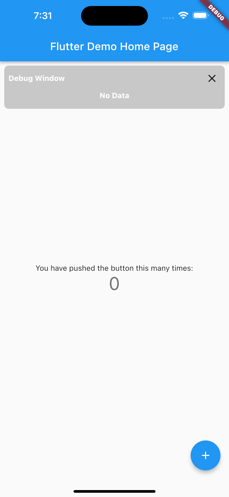
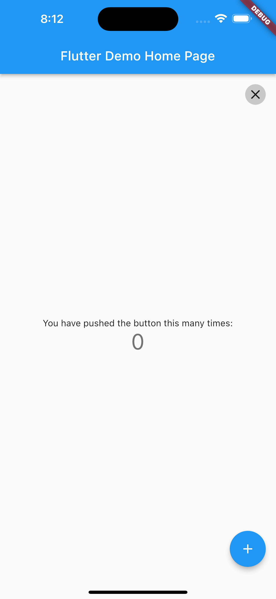

# debug_window

Useful debug window widget for flutter. If you press the close icon, this debug window is minimized.

## How to use

```dart
DebugWindow(
    debugContent: Padding(
        padding: const EdgeInsets.all(8),
        child: Row(
            children: [
                Text(
                    'example: ${streamData}',
                    style: contentTextStyle,
                ),
            ],
        ),
    ),
```

## Arguments

``debugContent``: You give this argument some content you would like to represent on a screen in your flutter app.

``backgroundColor``: This value is a color of debug window. Default value is ``Colors.black.withOpacity(0.2)``.

``isBottom``: In the case that you wouldn't like to put on top, you change this value to ``true``. Then debug window is represented on bottom.

## Remark

The text color in this debug window is black by default. Therefore, I recommend to specify the style of the character, like [``style: contentTextStyle``](https://github.com/Ryotaewamoto/debug_window/blob/main/lib/src/content_text_styles.dart).
